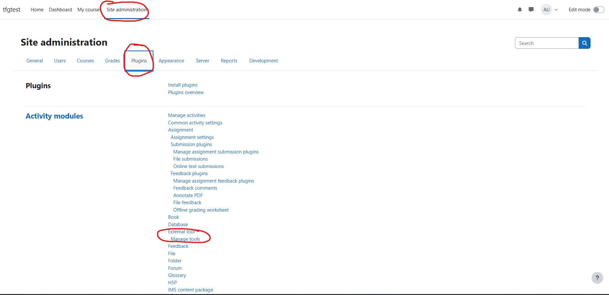
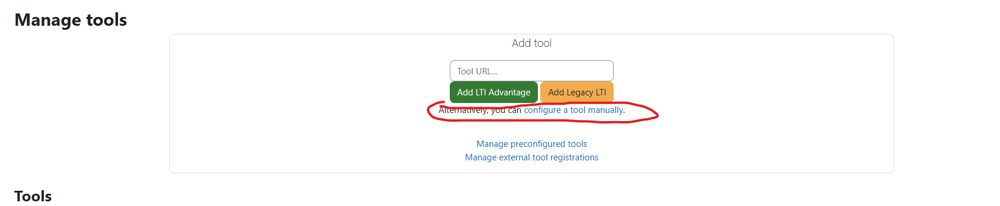
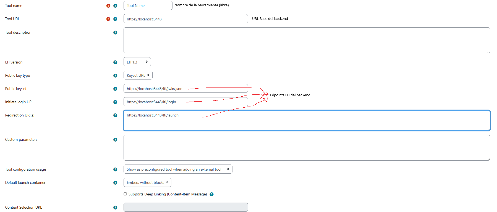
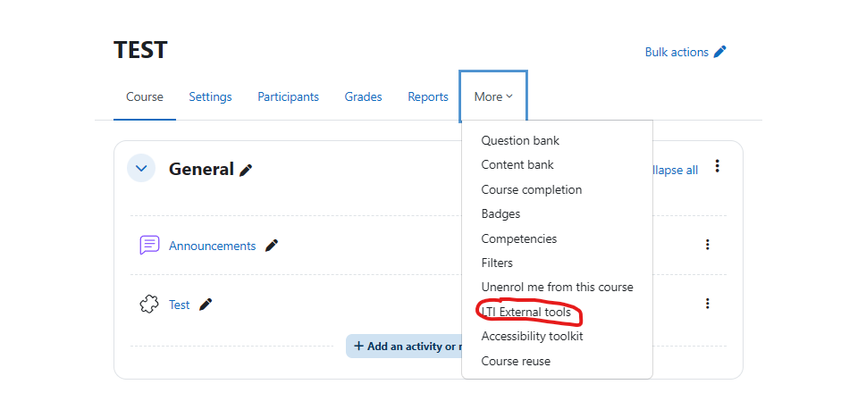
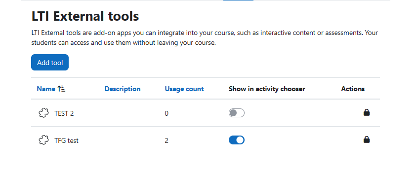

# TFG Gamificación en Plataformas de Aprendizaje

Este es el repositorio para el **TFG sobre Gamificación en Plataformas de Aprendizaje**, creado por José María Gómez Pulido y dirigido por Antonio Calvo Morata y Pablo Gutiérrez Sánchez.

## Instalación

Este proyecto está dividido en dos partes, el servidor backend, disponible en la carpeta `server`; y el cliente, disponible en la carpeta `client`. Para la instalación de las librerías necesarias, se debe ejecutar el comando `npm install` en la raíz de cada una de estas carpetas.

## Configurar HTTPS

Para que esta aplicación funcione, es necesario generar certificados https, ya que hacemos uso de cross-site cookies, y algunos navegadores solo lo permiten a través del protocolo https. 

La configuración de los certificados se puede encontrar en los siguientes archivos:  
```js
// server/src/app.js
var privateKey = fs.readFileSync("../certs/key.pem", 'utf8')
var certificate = fs.readFileSync("../certs/server.crt", 'utf8');
```

```js
// client/vite.config.js
const httpsConfig = {
  cert: fs.readFileSync("../certs/server.crt", 'utf8'),
  key: fs.readFileSync("../certs/key.pem", 'utf8'),
};
```

## Variables de entorno

Ambas partes del proyecto disponen de un archivo `.env.example` en el que están definidas y comentadas las variables de entorno necesarias para que el proyecto funcione correctamente. Para que estos archivos se apliquen, haced una copia sin la extensión `.example`.

## Configurar los puertos

- El puerto del cliente está definido en `client/vite.config.js` 
```js
export default defineConfig({
  //...
  server: {
    port: 4443,
    https: httpsConfig,
    origin: 'https://localhost:4443', //El número al final de esta URL tiene que coincidir con el puerto
  },
  //...
});

```
- El puerto del backend debe ser definido en el archivo `server/.env`
```
...

PORT=3443

...
```

## Ejecutar la aplicación

Para ejecutar el servidor:
```
cd server
npm run dev
```

Para ejecutar el cliente:
```
cd client
npm run dev
```

Con esto, la app debería estar disponible en los puertos especificados en el paso anterior, pero aún no puede usarse desde Moodle.

## Añadir la herramienta a Moodle

Para hacer esto, es necesario seguir los siguientes pasos:

1. Ir a `Site Administration > Plugins > Activity Modules > External Tools > Manage Tool` en el servidor de Moodle.



2. Pulsar en `Cofigure a tool manually`



3. Usar la siguiente configuración



4. Guardar la configuración, y activar la herramienta en un curso.




Una vez hecho esto, la herramienta debería de aparecer para añadir como actividad en el curso, y lanzar el cliente al ejecutarse.

Es posible que sea necesario acceder al frontend en una pestaña aparte para que el navegador solicite algunos permisos, ya que parece no ser capaz de hacerlo desde el bloque embebido en Moodle.

## Versiones

- Node.js 24.11.1
- MongoDB 8.2
- Moodle 4.5 ([Instalación](https://docs.moodle.org/405/en/Installing_Moodle))